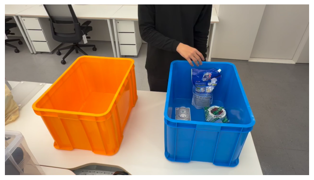
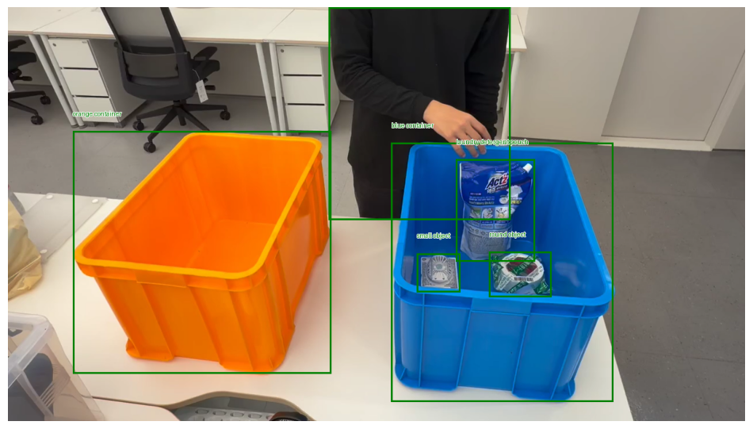

# Gemini Robotics-ER 1.5 API Test

Google Deepmind의 VLM모델인 Gemini Robotics-ER 1.5를 API를 통해 사용한 간단한 테스트 결과 및 코드를 공유합니다. 

아래와 같이 구글 드라이브 폴더에 테스트 코드, 이미지 및 비디오를 업로드 한 후 Google Colab을 통해 실행해 보실 수 있습니다.

```bash
my_project/                  # 프로젝트 최상위 폴더
│
├── gemini_er_img_test.ipynb     # 이미지 테스트용 노트북 (Point, Box, Segmentation 등)
├── gemini_er_video_test.ipynb   # 비디오 테스트용 노트북
│
└── assets/                      # 리소스 저장 폴더
    │
    ├── image.png                # 테스트 할 이미지 파일
    └── video.mp4                # 테스트 할 비디오 파일
```

## 이미지 테스트트

### 원본 이미지


### Bounding Box
```python
PROMPT = """
Return bounding boxes for all items in the image.
Return bounding boxes as a JSON array with labels. Never return masks or code fencing.
The format should be as follows: [{"box_2d": [ymin, xmin, ymax, xmax], "label": <label>}]
normalized to 0-1000.
"""
```


### Object Labeling
```python
PROMPT = """
Point to all identifiable items in the image.
The label returned should be an identifying name for the object detected.
The answer should follow the json format: [{"point": <point>, "label": <label1>}, ...].
The points are in [y, x] format normalized to 0-1000.
"""
```


### Segmentation 
```python
objects_list = ["box tape", "air freshener", "liquid detergent refill pouch"]
PROMPT = f"""
Provide the segmentation masks for the following objects in this image:
{", ".join(objects_list)}.

The answer should follow the JSON format:
[
  {{
    "box_2d": [ymin, xmin, ymax, xmax],
    "label": "<label for the object>",
    "mask": "data:image/png;base64,<base64 encoded PNG mask>"
  }},
  ...
]

The box_2d coordinates should be normalized to 0-1000 and must be integers.
The mask should be a base64 encoded PNG image where non-zero pixels indicate
the mask.
"""
```


### Trajectory Generation
```python
PROMPT = """
Identify a box containing liquid detergent refills and an empty box. Select one liquid detergent refill pouch from the filled box. Plan a trajectory to move it into the empty box.

Place a starting point on the refill pouch, then 10 intermediate points along the path, then the final point inside the empty box.

The answer should follow the json format: [{"point": <point>, "label": <seq_num>}, ...].
"""
```


## 비디오 테스트

### 원본 비디오


### Object Tracking
* 프레임 단위로 분리하여 처리
* 프레임별로 요청을 하는 방식으로 테스트를 진행하여, 길이가 짧음(호출 횟수 제한)
* 일부로 프레임 수를 낮추어 잡음(5 frame 단위로 처리)


## 참고

* Model Info: [DeepMind Gemini Robotics-ER](https://deepmind.google/models/gemini-robotics/gemini-robotics-er/)
* API Documentation: [Gemini API Robotics Overview (KO)](https://ai.google.dev/gemini-api/docs/robotics-overview?hl=ko)
* Official Cookbook: [Gemini Robotics-ER Quickstart](https://github.com/google-gemini/cookbook/blob/main/quickstarts/gemini-robotics-er.ipynb)
